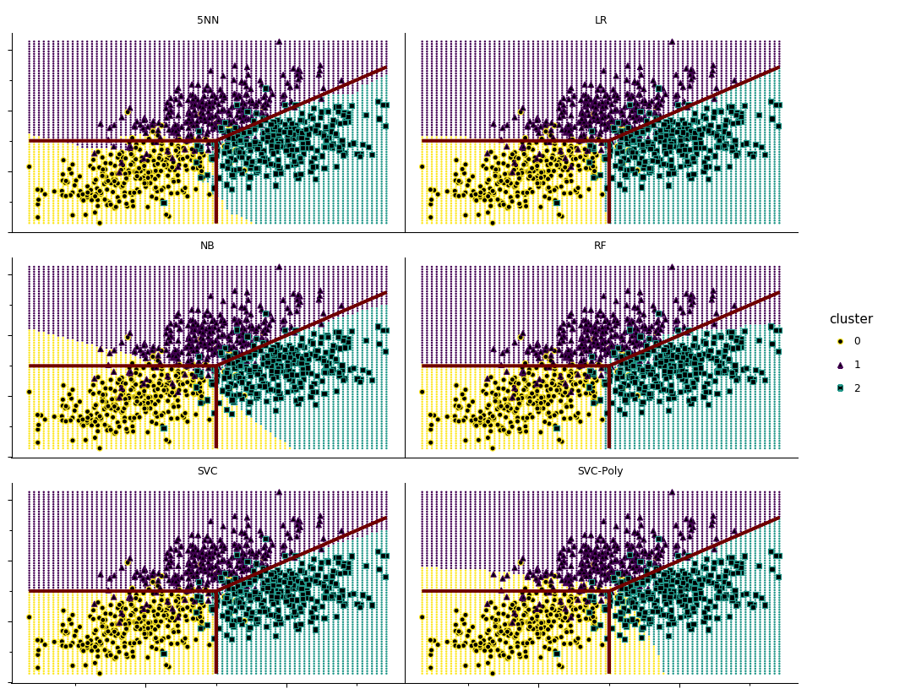

# Random Data-Science Stuff

A bunch of random DS stuff.

## Notebooks

1. [know-your-boundaries](https://github.com/AvivNavon/radss/blob/master/notebooks/know-your-boundaries.ipynb):
    Visualizing the decision boundaries of some commonly used classifiers.
    
2. [visualizing-high-dim-data](https://github.com/AvivNavon/radss/blob/master/notebooks/visualizing-high-dim-data.ipynb):
    Using UMAP, t-SNE and PCA to visualize high-dimensional datasets.
    